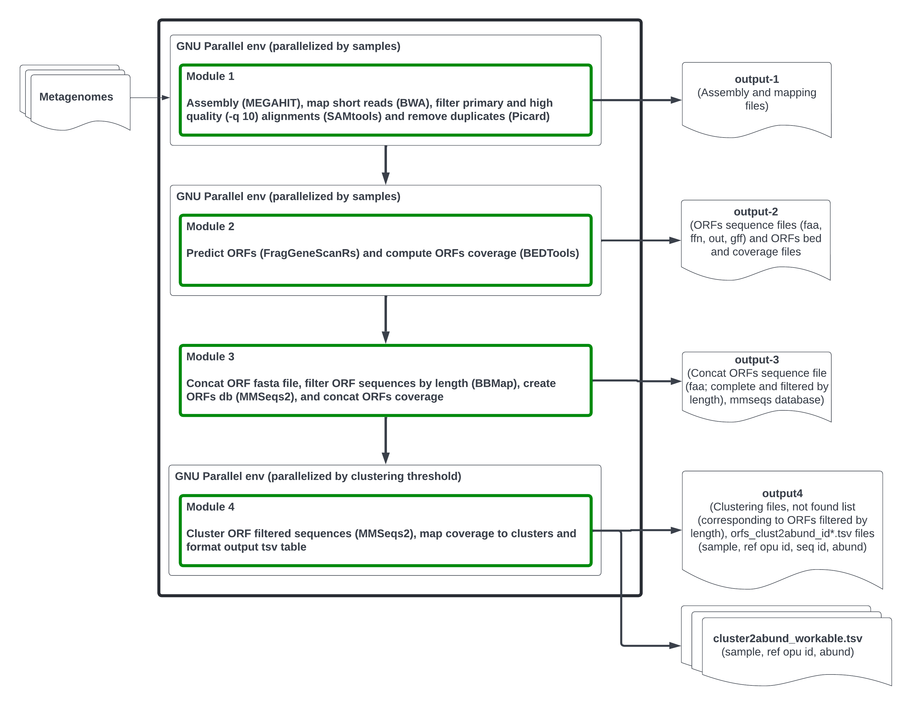

# Mg-Clust
## Clustering of ORF sequences in metagenomic data

Mg-Clust is a Nextflow pipeline for computing Operational Protein Units (OPUs) from metagenomic data. It takes paired-end reads from multiple samples, assembles them, maps the reads back onto the assembled contigs to compute per-ORF coverage, predicts ORFs, and clusters them by amino acid sequence identity. Per-ORF coverage values are then aggregated across all ORFs within each cluster to produce two per-OPU abundance tables: one based on mean sequencing depth and one based on read counts.



---

# Repository structure

```
Mg-Clust/
├── bin/                          # Python pipeline scripts
│   ├── mg-clust-module-1.py      # De novo assembly and read mapping
│   ├── mg-clust-module-2.py      # ORF prediction and coverage estimation
│   ├── mg-clust-module-3.py      # ORF filtering and MMseqs2 DB creation
│   ├── mg-clust-module-4.py      # ORF clustering and abundance tables
│   └── utils.py                  # Shared utility functions
├── docker/
│   ├── Dockerfile.module-1       # Docker image for module 1
│   ├── Dockerfile.module-2       # Docker image for module 2
│   ├── Dockerfile.module-3       # Docker image for module 3
│   ├── Dockerfile.module-4       # Docker image for module 4
│   └── resources/                # Conda environment YAML files
├── modules/
│   ├── mg-clust-module-1.nf      # Nextflow process: MODULE1
│   ├── mg-clust-module-2.nf      # Nextflow process: MODULE2
│   ├── mg-clust-module-3.nf      # Nextflow process: MODULE3
│   └── mg-clust-module-4.nf      # Nextflow process: MODULE4
├── figures/
│   └── MG-Clust.png              # Pipeline diagram
├── test/                         # Test data and test scripts
├── main.nf                       # Nextflow pipeline entry point
├── nextflow.config               # Pipeline configuration and parameters
└── LICENSE
```

---

# Installation

## Requirements

- [Nextflow](https://www.nextflow.io) >= 23.x
- [Docker](https://www.docker.com)

All tool dependencies are packaged in Docker images hosted on GitHub Container Registry. No local tool installation is required beyond Nextflow and Docker.

## Docker images

Docker images are pulled automatically from GitHub Container Registry when the pipeline runs. Dockerfiles and build instructions for developers are available in the `docker/` directory.

---

# How to use

## Quick start

```bash
nextflow run main.nf --input_dir data/reads --output_dir results
```

By default, Nextflow looks for paired-end reads matching `*_R{1,2}*.fastq` inside `input_dir`.

## Input

Paired-end FASTQ files placed in the directory specified by `--input_dir`. Sample names are inferred automatically from filenames using `--reads_pattern`.

```
data/reads/
    sample1_R1.fastq
    sample1_R2.fastq
    sample2_R1.fastq
    sample2_R2.fastq
```

## Parameters

All parameters can be set in `nextflow.config` or passed on the command line with `--param value`.

| Parameter | Default | Description |
|---|---|---|
| `input_dir` | `./test/data` | Directory containing input paired-end reads |
| `output_dir` | `./test/mg-clust-output` | Directory where all module outputs are published |
| `reads_pattern` | `*_R{1,2}*.fastq` | Glob pattern used to match paired-end read files |
| `nslots` | `16` | Number of threads per process |
| `stop_at_module` | `4` | Stop the pipeline after this module (1–4). Outputs of the last module to run are always published. See [partial execution](#partial-execution) |
| `full_output` | `false` | Publish outputs from all modules, not just the last one. When `stop_at_module < 4`, the last module's outputs are always published regardless of this flag |
| `assem_preset` | `meta-sensitive` | MEGAHIT assembly preset |
| `min_contig_len` | `250` | Minimum contig length (bp); shorter contigs are discarded |
| `min_seq` | `5` | Minimum number of assembled contigs required to continue |
| `train_file_name` | `illumina_1` | FragGeneScanRs training model |
| `min_orf_length` | `60` | Minimum ORF length (amino acids); shorter ORFs are discarded |
| `clust_thres` | `0.7` | MMseqs2 sequence identity threshold for clustering |
| `clust_cov_len` | `0.85` | Minimum fraction of aligned residues for clustering (`-c` in MMseqs2) |

## Partial execution

The `--stop_at_module` parameter allows the pipeline to be stopped after a specific module. This is useful for inspecting intermediate results or running only part of the analysis.

```bash
# Run assembly and read mapping only (module 1)
nextflow run main.nf --stop_at_module 1

# Run through ORF prediction (modules 1–2)
nextflow run main.nf --stop_at_module 2

# Run through ORF filtering and MMseqs2 DB creation (modules 1–3)
nextflow run main.nf --stop_at_module 3

# Run the full pipeline (default)
nextflow run main.nf
```

The outputs of the last module to run are always published to `--output_dir`. Intermediate module outputs (from earlier modules) are only published when `--full_output true` is set:

```bash
# Run through module 2 and publish outputs from both modules 1 and 2
nextflow run main.nf --stop_at_module 2 --full_output true
```

---

# Module documentation

> **Note:** The sections below document the parameters and behaviour of each Python module for reference purposes. These scripts are executed automatically by the Nextflow pipeline and are not intended to be run directly by users.

---

## mg-clust-module-1.py

> Stop after this module with `--stop_at_module 1`.

De novo assembly of paired-end reads and mapping back to the assembly.

```bash
mg-clust-module-1.py \
    --reads1            <R1.fastq> \
    --reads2            <R2.fastq> \
    --sample_name       <sample> \
    --output_dir        <output_dir> \
    --nslots            4 \
    --assem_preset      meta-sensitive \
    --min_contig_length 250 \
    --min_seq           5 \
    [--markdup] \
    [--overwrite]
```

| Parameter | Default | Description |
|---|---|---|
| `--reads1` | — | R1 FASTQ file (required) |
| `--reads2` | — | R2 FASTQ file (required) |
| `--sample_name` | — | Sample name used to prefix output files (required) |
| `--output_dir` | — | Output directory (required) |
| `--assem_preset` | `meta-sensitive` | MEGAHIT preset (`meta-sensitive`, `meta-large`, etc.) |
| `--min_contig_length` | `250` | Discard contigs shorter than this (bp) |
| `--min_seq` | `5` | Minimum assembled sequences to continue |
| `--markdup` | `false` | Run Picard MarkDuplicates to remove PCR duplicates |
| `--nslots` | `4` | Threads |
| `--overwrite` | `false` | Overwrite output directory if it exists |

**Outputs:**
- `<sample_name>/assembly/<sample_name>.contigs.fa` — assembled contigs
- `<sample_name>/<sample_name>_sorted.bam` — coordinate-sorted BAM of reads mapped to contigs

---

## mg-clust-module-2.py

> Stop after this module with `--stop_at_module 2`.

ORF prediction from assembled contigs and per-ORF coverage estimation.

```bash
mg-clust-module-2.py \
    --assembly_file   <contigs.fa> \
    --bam_file        <sorted.bam> \
    --sample_name     <sample> \
    --output_dir      <output_dir> \
    --nslots          4 \
    --train_file_name illumina_1 \
    [--overwrite]
```

| Parameter | Default | Description |
|---|---|---|
| `--assembly_file` | — | FASTA file of assembled contigs (required) |
| `--bam_file` | — | Sorted BAM of reads mapped to contigs (required) |
| `--sample_name` | — | Sample name used to prefix output files (required) |
| `--output_dir` | — | Output directory (required) |
| `--train_file_name` | `illumina_1` | FragGeneScanRs training model |
| `--nslots` | `4` | Threads |
| `--overwrite` | `false` | Overwrite output directory if it exists |

**Outputs:**
- `<sample_name>/<sample_name>_orfs.faa` — predicted ORF protein sequences
- `<sample_name>/<sample_name>_orfs_meancov.tsv` — mean sequencing depth per ORF
- `<sample_name>/<sample_name>_orfs_readscov.tsv` — read count per ORF

---

## mg-clust-module-3.py

> Stop after this module with `--stop_at_module 3`.

Concatenation of per-sample ORFs, length filtering, and MMseqs2 database creation. Runs once across all samples.

```bash
mg-clust-module-3.py \
    --orf_files      <sample1_orfs.faa> <sample2_orfs.faa> ... \
    --meancov_files  <sample1_meancov.tsv> <sample2_meancov.tsv> ... \
    --readscov_files <sample1_readscov.tsv> <sample2_readscov.tsv> ... \
    --output_dir     <output_dir> \
    --nslots         4 \
    --min_orf_length 60 \
    [--overwrite]
```

| Parameter | Default | Description |
|---|---|---|
| `--orf_files` | — | Per-sample ORF FASTA files (required) |
| `--meancov_files` | — | Per-sample mean coverage TSV files (required) |
| `--readscov_files` | — | Per-sample read count TSV files (required) |
| `--output_dir` | — | Output directory (required) |
| `--min_orf_length` | `60` | Minimum ORF length in amino acids; shorter ORFs are discarded |
| `--nslots` | `4` | Threads |
| `--overwrite` | `false` | Overwrite output directory if it exists |

**Outputs:**
- `orfs_filt_db*` — MMseqs2 database of filtered ORFs (multiple files sharing the prefix)
- `orfs_meancov.tsv` — merged mean coverage table (columns: `sample_name`, `orf_id`, `mean_coverage`)
- `orfs_readscov.tsv` — merged read count table (columns: `sample_name`, `orf_id`, `read_count`)

---

## mg-clust-module-4.py

ORF clustering with MMseqs2 and generation of per-OPU abundance tables. Runs once.

```bash
mg-clust-module-4.py \
    --orfs_db        orfs_filt_db \
    --meancov_table  <orfs_meancov.tsv> \
    --readscov_table <orfs_readscov.tsv> \
    --output_dir     <output_dir> \
    --nslots         4 \
    --clust_thres    0.7 \
    --clust_cov_len  0.85 \
    [--overwrite]
```

| Parameter | Default | Description |
|---|---|---|
| `--orfs_db` | — | MMseqs2 database prefix (required) |
| `--meancov_table` | — | Merged mean coverage table from module 3 (required) |
| `--readscov_table` | — | Merged read count table from module 3 (required) |
| `--output_dir` | — | Output directory (required) |
| `--clust_thres` | `0.7` | Sequence identity threshold for MMseqs2 clustering |
| `--clust_cov_len` | `0.85` | Minimum fraction of aligned residues (`-c` in MMseqs2) |
| `--nslots` | `4` | Threads |
| `--overwrite` | `false` | Overwrite output directory if it exists |

**Outputs (inside `clust_orfs_id<N>perc/`):**
- `orfs_clust_id<N>perc.tsv` — cluster membership table (columns: `cluster_id`, `orf_id`)
- `orfs_clust_id<N>perc2meancov.tsv` — per-ORF mean coverage mapped to cluster IDs
- `orfs_clust_id<N>perc2readscov.tsv` — per-ORF read counts mapped to cluster IDs
- `orfs_clust_id<N>perc_not_found.list` — ORFs present in coverage tables but absent from clusters

**Outputs (in root output directory):**
- `orfs_clust_id<N>perc_meancov_workable.tsv` — mean coverage summed per cluster per sample
- `orfs_clust_id<N>perc_readscov_workable.tsv` — read counts summed per cluster per sample

---

## Output directory structure

```
<output_dir>/
    module1/
        <sample_name>/
            assembly/<sample_name>.contigs.fa
            <sample_name>_sorted.bam
    module2/
        <sample_name>/
            <sample_name>_orfs.faa
            <sample_name>_orfs_meancov.tsv
            <sample_name>_orfs_readscov.tsv
    module3/
        orfs_filt_db*
        orfs_meancov.tsv
        orfs_readscov.tsv
    module4/
        clust_orfs_id70perc/
            orfs_clust_id70perc.tsv
            orfs_clust_id70perc2meancov.tsv
            orfs_clust_id70perc2readscov.tsv
            orfs_clust_id70perc_not_found.list
        orfs_clust_id70perc_meancov_workable.tsv
        orfs_clust_id70perc_readscov_workable.tsv
```

---

# Dependencies

## Pipeline

| Tool | Version | Purpose |
|---|---|---|
| [Nextflow](https://www.nextflow.io) | >= 23.x | Workflow manager |
| [Docker](https://www.docker.com) | — | Container runtime |

## Module 1

| Dependency | Version | Purpose |
|---|---|---|
| Python | >= 3.8 | Script runtime |
| [MEGAHIT](https://github.com/voutcn/megahit) | 1.2.9 | De novo metagenome assembly |
| [BWA](https://github.com/lh3/bwa) | 0.7.19 | Short read mapping |
| [samtools](https://www.htslib.org) | 1.23 | SAM/BAM processing and sorting |
| [Picard](https://broadinstitute.github.io/picard) | 3.4.0 | PCR duplicate marking (optional) |

## Module 2

| Dependency | Version | Purpose |
|---|---|---|
| Python | >= 3.8 | Script runtime |
| [FragGeneScanRs](https://github.com/unipept/FragGeneScanRs) | 1.1.0 | ORF prediction |
| [bedtools](https://bedtools.readthedocs.io) | 2.31.1 | Per-ORF coverage computation |

## Module 3

| Dependency | Version | Purpose |
|---|---|---|
| Python | >= 3.8 | Script runtime |
| [BBTools](https://jgi.doe.gov/data-and-tools/software-tools/bbtools) | 37.62 | ORF length filtering (bbduk) |
| [MMseqs2](https://github.com/soedinglab/MMseqs2) | 18.8cc5c | Sequence database creation |

## Module 4

| Dependency | Version | Purpose |
|---|---|---|
| Python | >= 3.8 | Script runtime |
| [pandas](https://pandas.pydata.org) | 3.0.1 | Abundance table processing |
| [MMseqs2](https://github.com/soedinglab/MMseqs2) | 18.8cc5c | ORF clustering |

---

# License

This project is licensed under the GNU General Public License v3.0. See the [LICENSE](LICENSE) file for the full text.

```
Mg-Clust: Clustering of ORF sequences in metagenomic data
Copyright (C) 2024  epereira

This program is free software: you can redistribute it and/or modify
it under the terms of the GNU General Public License as published by
the Free Software Foundation, either version 3 of the License, or
(at your option) any later version.

This program is distributed in the hope that it will be useful,
but WITHOUT ANY WARRANTY; without even the implied warranty of
MERCHANTABILITY or FITNESS FOR A PARTICULAR PURPOSE. See the
GNU General Public License for more details.

You should have received a copy of the GNU General Public License
along with this program. If not, see <http://www.gnu.org/licenses/>.
```
